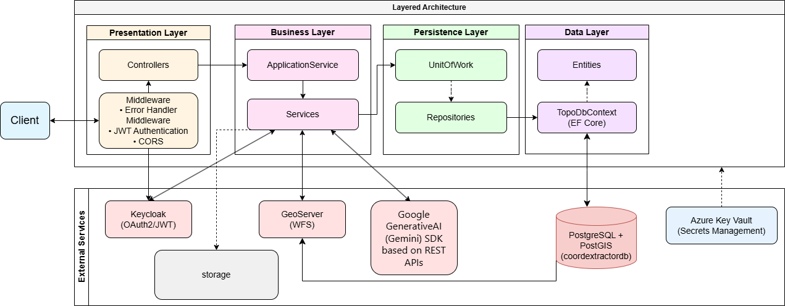
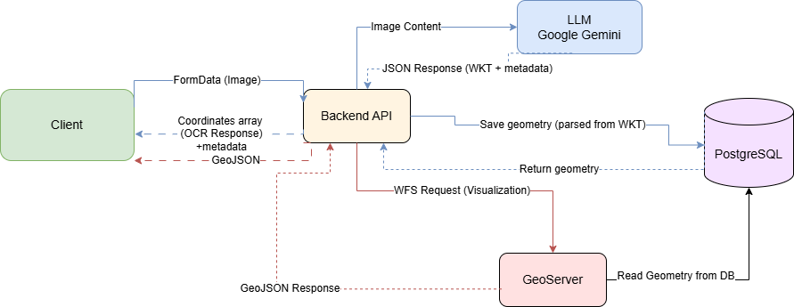

# WebAiAPI - ASP.NET Core 8.0 Web API

## Πώς Λειτουργεί
Το έργο χωρίζεται σε δύο μέρη:

*   **Backend**: [WebAiAPIPro](https://github.com/liavergou/WebAiAPIPro.git)
*   **Frontend**: [topo-ocr-wkt](https://github.com/liavergou/topo-ocr-wkt.git)

> Το παρόν repository αφορά το **Backend**.
	
## Πίνακας Περιεχομένων

1. [Περιγραφή](#1-περιγραφή)
2. [Αρχιτεκτονική](#2-αρχιτεκτονική)
3. [Λειτουργικότητα](#3-λειτουργικότητα)
4. [Βασικές Ροές Δεδομένων](#4-βασικές-ροές-δεδομένων)
5. [Δομή](#5-δομή)
6. [Tech Stack](#6-tech-stack)
7. [Εγκατάσταση](#7-εγκατάσταση)
8. [Ανάπτυξη σε Παραγωγή (Production Simulation)](#8-ανάπτυξη-σε-παραγωγή-production-simulation)
9. [API Endpoints](#9-api-endpoints)
10. [Testing & Documentation](#10-testing--documentation)

## 1. Περιγραφή
Το WebAiAPI αποτελεί το REST API της εφαρμογής CoordAiExtractor. Αυτοματοποιεί την εξαγωγή πολυγώνων γεωτεμαχίων από εικόνες (jpg/png) πινάκων συντεταγμένων από τοπογραφικά διαγράμματα σε ΕΓΣΑ '87.
Με την χρήση Google GenerativeAI και επιλεγμένου prompt τις μετατρέπει σε γεωχωρικά πολύγωνα (WKT) και παρέχει τις συντεταγμένες σε πίνακες, δίνοντας την δυνατότητα επεξεργασίας και οπτικοποίησης μέσω GeoServer και εξαγωγής σε Shapefile.

## 2. Αρχιτεκτονική
Layered Architecture με διαχωρισμό ευθυνών


## 3. Λειτουργικότητα

### Διαχείριση Συστήματος (Role: Admin, Manager)
- **Διαχείριση Χρηστών (Users)**: Δημιουργία, επεξεργασία, διαγραφή και διαχείριση ρόλων χρηστών μέσω Keycloak Admin REST API.
- **Διαχείριση Μελετών (Projects)**: Δημιουργία, επεξεργασία, διαγραφή και ανάθεση μελετών σε χρήστες (Project Assignment) με role: Member και πλήρη πρόσβαση σε χρήστες με role: Admin και Manager. Κατά τη δημιουργία, προετοιμάζεται αυτόματα η δομή φακέλων (`original`, `deleted`) στον Server, όπου πρέπει να τοποθετηθούν τα αρχικά τοπογραφικά (jpg/png).
- **Διαχείριση Prompts**: Δημιουργία και διαχείριση των AI Prompts.

### Βασικές Λειτουργίες
- **Αυτόματη εξαγωγή**: Χρήση LLM (Google Gemini) για την εξαγωγή WKT απευθείας από την εικόνα του πίνακα συντεταγμένων.
- **Γεωχωρική μετατροπή**: Αυτόματη ανάλυση και μετατροπή των αποτελεσμάτων σε γεωχωρικά δεδομένα (Polygon Geometry).
- **Εργασία OCR**: Πλήρης κύκλος (Upload -> AI Processing -> coordinates review).

### GeoServer & εξαγωγές
- **Λειτουργία GeoServer**: Αυτόματη ενημέρωση WFS layer από βάση δεδομένων και reverse proxy μηχανισμός για πρόσβαση από τον χρήστη.
- **Shapefile Export**: Εξαγωγή των πολυγώνων κάθε project σε αρχείο `.shp`.

### Authentication & Authorization
- **Ενσωμάτωση Keycloak**: Αυθεντικοποίηση χρηστών με JWT Tokens και κεντρική διαχείριση (Users/Roles) μέσω Admin REST API.
- **Service Authorization**: Επικοινωνεί με ασφάλεια (Client Credentials) με το Keycloak για τις διαχειριστικές ενέργειες.
- **Role Based Access Control (RBAC)**:
  - **Admin,Manager**: Πλήρης πρόσβαση στο σύστημα, διαχείριση χρηστών,μελετών,prompts, καθώς και όλες οι λειτουργίες CRUD.
  - **Member**: Δημιουργία και διαχείριση conversion jobs σε μελέτες που του έχουν ανατεθεί.
- **GeoServer Security**: Το Backend λειτουργεί ως reverse proxy. Πιστοποιεί τον χρήστη και προωθεί την ταυτότητά του στο GeoServer μέσω εσωτερικών headers, εξασφαλίζοντας ελεγχόμενη πρόσβαση στα δεδομένα.

## 4. Βασικές Ροές Δεδομένων


## 5. Δομή
```bash
│
├── CoordExtractorApp/
│   ├── Configuration/               # Ρυθμίσεις Keycloak (DI) & AutoMapper
│   ├── Controllers/                 # Presentation Layer (API Controllers)
│   ├── Core/                        
│   │   ├── Enums/                   # Σταθερές τιμές
│   │   └── Filters/                 # Κριτήρια Αναζήτησης (DTOs)
│   ├── Data/                        # Data Layer (DbContext & Entities)
│   ├── DTO/                         # Αντικείμενα Μεταφοράς Δεδομένων (DTOs)
│   │   ├── GenerativeAI/            
│   │   └── Keycloak/                
│   ├── Exceptions/                  # Custom Εξαιρέσεις (Exceptions)
│   │   └── keycloak/
│   ├── Helpers/                     # Exception Handling Middleware,Ρυθμίσεις Swagger & File Utilities
│   ├── Migrations/                  # EF Database Migrations
│   ├── Models/                      # Βοηθητικά Μοντέλα (Application Models)
│   ├── Repositories/                # Persistence Layer (Repository Pattern)
│   ├── Services/                    # Business Layer
│   │   ├── GenerativeAI/            # Εξαγωγή γεωμετρίας (Image-to-WKT)
│   │   ├── Geoserver/               # Υπηρεσία reverse proxy για GeoServer
│   │   └── Keycloak/                # Διαχείριση Χρηστών (Keycloak Admin API)
│   ├── storage/                     # Στατικά αρχεία
│   │   └── images/
│   │       └── {ProjectId}/         # Cropped (Επεξεργασμένες)
│   │           ├── original/        # Αρχικές εικόνες jpg/png (Source - Required)
│   │           └── deleted/         # Διεγραμμένες εργασίες (Backup των διαγραμμένων)
│   ├── appsettings.json             # Configuration
│   ├── appsettings.Development.json # Configuration dev
│   └── Program.cs                   # Entry Point
│
├── Infrastructure/                  # External Services Setup
│   ├── keycloak/                    # Keycloak Realm Export & Docker Config
│   │   └── README.md                # Οδηγίες Keycloak
│   └── geoserver/                   # GeoServer Data Directory (Config, Styles, Data)
│       ├── README.md                # Οδηγίες GeoServer
│       ├── security/                
│       ├── styles/                  
│       └── workspaces/
│
└── Testing/                         # Postman Collections & Environments
    ├── WebAiAPI_Tests.postman_collection.json
    ├── TopoApp-Development.postman_environment.json
    └── TopoApp-Production.postman_environment.json
```

## 6. Tech Stack
- **Framework**: ASP.NET Core 8.0 Web API
- **Data Access**: Entity Framework Core 9 (Npgsql Provider)
- **Database**: PostgreSQL 18 με PostGIS extension
- **Αυθεντικοποίηση**: Keycloak (Docker Latest) via OAuth2 + JWT
- **AI**: Google Gemini (Google.GenerativeAI v3.4)
- **Mapping**: AutoMapper
- **Logging**: Serilog
- **Documentation**: Swagger / OpenAPI
- **Γεωχωρικά Δεδομένα**: NetTopologySuite & PostGIS
- **GIS Server**: GeoServer 2.28.1 (WFS services)
- **Web Server**: IIS (Production Simulation)


## 7. Εγκατάσταση

Ανάπτυξη σε περιβάλλον **Development** (localhost).

Ακολουθήστε τα βήματα για να τρέξετε την εφαρμογή τοπικά:

### 1. Λήψη Κώδικα (Clone) & Προετοιμασία
```bash
git clone https://github.com/YOUR_REPO/WebAiAPIPro.git
cd WebAiAPIPro
```
**Ενεργοποίηση Storage**:
```bash
cd CoordExtractorApp
ren storage_example storage
cd ..
```

### 2. Υποδομές

#### Keycloak (Docker)
Για εγκατάσταση και ρύθμιση του Keycloak: [Αναλυτικές οδηγίες](Infrastructure/keycloak/README.md)

> **Περιλαμβάνει**: Realm `TopoApp`, 3 roles (Admin/Manager/Member), clients (web-api, react-app).

#### GeoServer
Για εγκατάσταση και ρύθμιση του GeoServer: [Αναλυτικές οδηγίες](Infrastructure/geoserver/README.md)

### 3. Βάση Δεδομένων (Postgres)
1.  Βεβαιωθείτε ότι έχετε εγκατεστημένη την **PostgreSQL 18** (Local).
2.  Δημιουργήστε μια κενή βάση δεδομένων με όνομα `coordextractordb`.
3.  Εκτελέστε το παρακάτω Query στη βάση `coordextractordb` μέσω pgAdmin για να ενεργοποιήσετε τα γεωχωρικά δεδομένα:
    ```sql
    CREATE EXTENSION postgis;
    ```

### 4. Ρυθμίσεις (Configuration)
1. Ανοίξτε το αρχείο `CoordExtractorApp/appsettings.Development.json`. Συμπληρώστε τα παρακάτω πεδία:

| Section | Key | Value (Development / Localhost) |
| :--- | :--- | :--- |
| **ConnectionStrings** | `DefaultConnection` | `Host=localhost;Database=coordextractordb;Username=<USERNAME>;Password=<PASSWORD>;Port=5432;Pooling=true;Maximum Pool Size=20` |
| **Gemini** | `Credentials:ApiKey` | Το API Key από το [Google AI Studio](https://aistudio.google.com/). |
| **Keycloak** | `Authority` | `http://localhost:8080/realms/TopoApp` |
| | `Audience` | `web-api` |
| **Keycloak:AdminApi** | `ClientSecret` | Το Secret του `web-api` client από το Keycloak Admin. |
| | `TokenUrl` | `http://localhost:8080/realms/TopoApp/protocol/openid-connect/token` |
| | `AdminApiUrl` | `http://localhost:8080/admin/realms/TopoApp/` |

2. Εφαρμόστε τα migrations από το **Package Manager Console** (Visual Studio):
    ```powershell
    Update-Database
    ```


### 5. Εκτέλεση
*   Ανοίξτε το `.sln` στο Visual Studio.
*   Πατήστε **F5**.

### 6. Development URLs
- **Backend API**: `https://localhost:5001`
- **Swagger UI**: `https://localhost:5001/swagger/index.html`
- **Keycloak**: `http://localhost:8080`
- **GeoServer**: `http://localhost:8085/geoserver`

## 8. Ανάπτυξη σε Παραγωγή (Production Simulation)

Ακολουθήστε τα βήματα για εγκατάσταση σε IIS (Production Simulation):

### 1. Προετοιμασία (Configuration)
Δημιουργήστε το `appsettings.production.json`.
*   **Secrets**: Χρησιμοποιήστε Environment Variables ή Azure Key Vault.
*   **IPs**: Αντικαταστήστε το `localhost` με την στατική IP του Server (π.χ. `192.168.1.3`) σε όλα τα URLs.

### 2. Build & Publish
Εκτελέστε την εντολή για να δημιουργήσετε τα αρχεία στoν φάκελο προορισμού (π.χ. `D:\Publish\Backend`):
```bash
dotnet publish -c Release -o "D:\Publish\Backend"
```

### 3. Ρυθμίσεις IIS (Site)
1.  **Create Website**: Port `8091`.
2.  **Physical Path**: `D:\Publish\Backend`.
3.  **App Pool**: Ρύθμιση σε "No Managed Code".

### 4. Storage (Virtual Directory)
Δημιουργήστε Virtual Directory για τις εικόνες:
1.  Δεξί κλικ στο Site -> **Add Virtual Directory**.
2.  **Alias**: `storage`
3.  **Physical Path**: `D:\Publish\Backend\storage`

### 5. Web Configs & CORS
Βεβαιωθείτε ότι υπάρχουν τα απαραίτητα `web.config`:
*   **Backend**: `Publish\Backend\web.config` (Δημιουργείται αυτόματα).
*   **Storage**: `Publish\Backend\storage\web.config` (**Χειροκίνητη προσθήκη** για CORS):
    ```xml
    <?xml version="1.0" encoding="utf-8"?>
    <configuration>
      <system.webServer>
        <httpProtocol>
          <customHeaders>
            <add name="Access-Control-Allow-Origin" value="*" />
          </customHeaders>
        </httpProtocol>
      </system.webServer>
    </configuration>
    ```

### 3. Production URLs
- **Backend API**: `http://192.168.1.3:8091/`
- **Frontend**: `http://192.168.1.3:8090/`
- **Keycloak**: `http://192.168.1.3:8080/`
- **GeoServer**: `http://192.168.1.3:8085/geoserver`
    
## 9. API Endpoints

| Resource | Method | Endpoint | Role | Description |
|----------|--------|----------|------|-------------|
| **Project** | `POST` | `/api/projects` | Admin, Manager | Δημιουργία νέου Project |
| | `GET` | `/api/projects` | Admin, Manager | Λίστα Projects (Management Grid Paginated) |
| | `GET` | `/api/projects/all` | Admin, Manager | Λίστα Projects|
| | `GET` | `/api/projects/{id}` | Auth | Λεπτομέρειες Project |
| | `PUT` | `/api/projects/{id}` | Admin, Manager | Ενημέρωση Project |
| | `DELETE` | `/api/projects/{id}` | Admin, Manager | Διαγραφή Project |
| | `GET` | `/api/projects/{id}/conversion-jobs` | Auth | Λήψη GeoJSON (ανα project) |
| | `GET` | `/api/projects/{id}/conversion-jobs/shp` | Admin, Manager | Export σε Shapefile (SHP) |
| | `POST` | `/api/projects/{projectId}/conversion-jobs/new` | Auth | Δημιουργία Job (Upload Image) |
| | `GET` | `/api/projects/{projectId}/conversion-jobs/{jobId}` | Auth | Λεπτομέρειες Job |
| | `PUT` | `/api/projects/{projectId}/conversion-jobs/{jobId}` | Auth | Ενημέρωση Job |
| | `DELETE` | `/api/projects/{projectId}/conversion-jobs/{jobId}` | Auth | Διαγραφή Job |
| **Prompt** | `POST` | `/api/prompts` | Admin, Manager | Δημιουργία AI Prompt |
| | `GET` | `/api/prompts` | Admin, Manager | Λίστα Prompts (Management Grid Paginated) |
| | `GET` | `/api/prompts/all` | Auth | Λίστα Prompts (User Menu) |
| | `GET` | `/api/prompts/{id}` | Auth | Λεπτομέρειες Prompt |
| | `PUT` | `/api/prompts/{id}` | Admin, Manager | Ενημέρωση Prompt |
| | `DELETE` | `/api/prompts/{id}` | Admin, Manager | Διαγραφή Prompt |
| **User** | `POST` | `/api/users` | Admin, Manager | Δημιουργία Χρήστη (Keycloak + DB) |
| | `GET` | `/api/users` | Admin, Manager | Λίστα Χρηστών (Management List) |
| | `GET` | `/api/users/paginated` | Admin, Manager | Λίστα Χρηστών (Management Grid Paginated) |
| | `GET` | `/api/users/{id}` | Auth | Λεπτομέρειες Χρήστη |
| | `PUT` | `/api/users/{id}` | Admin, Manager | Ενημέρωση Χρήστη (Keycloak + DB) |
| | `DELETE` | `/api/users/{id}` | Admin, Manager | Διαγραφή Χρήστη (Keycloak + DB) |
| | `GET` | `/api/users/{id}/projects` | Admin, Manager | Projects ανατεθειμένα στον χρήστη (Management View) |
| | `PUT` | `/api/users/{id}/projects` | Admin, Manager | Ανάθεση Projects σε χρήστη |
| **UserProjects** | `GET` | `/api/account/projects` | Auth | Τα Projects του συνδεδεμένου χρήστη (τιμες για role:Member αλλιώς [])|

## 10. Testing & Documentation

Συλλογή Postman διαθέσιμη στον φάκελο `CoordExtractorApp/Testing/`:

### Αρχεία

1. **`WebAiAPI_Tests.postman_collection.json`**
   Collection με 32 requests οργανωμένα σε 7 κατηγορίες

2. **`TopoApp-Development.postman_environment.json`**
   Environment για Development (`https://localhost:5001`)

3. **`TopoApp-Production.postman_environment.json`**
   Environment για Production (`http://192.168.1.3:8091`)

### Collection Structure

| Folder | Requests |
|--------|----------|
| **Authentication** |Admin, Manager, Member login (Keycloak tokens) |
| **Users** |CRUD operations, project assignments |
| **Prompts** |prompt CRUD management |
| **Projects** |Project CRUD, pagination, filters |
| **User Projects** |Get assigned projects (current user with role Member) |
| **Conversion Jobs** |Image upload, coordinate editing |
| **Geoserver** |GeoJSON & Shapefile exports |

### Εισαγωγή στο Postman

1. **Import Collection:**
   ```
   Postman → Import → CoordExtractorApp/Testing/WebAiAPI_Tests.postman_collection.json
   ```

2. **Import Environment:**
   ```
   Postman → Import → CoordExtractorApp/Testing/TopoApp-Development.postman_environment.json
   ```

3. **Select Environment:**
   Επιλέξτε το environment

### Testing Strategy

Όλα τα requests χρησιμοποιούν τη μεταβλητή `{{login_token}}` που γεμίζει αυτόματα από τα authentication requests.

#### Test με διαφορετικά Roles:

1. **Test ως Admin:**
   - Τρέξτε: `Authentication → login-admin`
   - Τώρα όλα τα requests χρησιμοποιούν Admin token
   - Δοκιμάστε όλα τα endpoints (Αναμένεται επιτυχία: Status 200/201 και δεδομένα)

2. **Test ως Manager:**
   - Τρέξτε: `Authentication → login-manager`
   - Δοκιμάστε τα endpoints (Αναμένεται επιτυχία: Status 200/201 και δεδομένα)

3. **Test ως Member:**
   - Τρέξτε: `Authentication → login-member`
   - Δοκιμάστε τα endpoints:
     Αποτελέσματα σύμφωνα με τον πίνακα εξουσιοδοτήσεων παρακάτω.

4. **Test χωρίς Authentication (401):**
   - Διαγράψτε το `login_token` από το environment (ή βάλτε κενό)
   - **Αναμένεται:** `401 Unauthorized` σε όλα

#### Authorization:

| Endpoint Test | Admin | Manager | Member | No Auth |
|---------------|-------|---------|--------|---------|
| POST /api/users | ✅ | ✅ | ❌ 403 | ❌ 401 |
| GET /api/users | ✅ | ✅ | ❌ 403 | ❌ 401 |
| GET /api/users/paginated | ✅ | ✅ | ❌ 403 | ❌ 401 |
| GET /api/users/{id} | ✅ | ✅ | ✅ | ❌ 401 |
| PUT /api/users/{id} | ✅ | ✅ | ❌ 403 | ❌ 401 |
| DELETE /api/users/{id} | ✅ | ✅ | ❌ 403 | ❌ 401 |
| GET /api/users/{id}/projects | ✅ | ✅ | ❌ 403 | ❌ 401 |
| PUT /api/users/{id}/projects | ✅ | ✅ | ❌ 403 | ❌ 401 |
| POST /api/projects | ✅ | ✅ | ❌ 403 | ❌ 401 |
| GET /api/projects | ✅ | ✅ | ❌ 403 | ❌ 401 |
| GET /api/projects?name=... | ✅ | ✅ | ❌ 403 | ❌ 401 |
| GET /api/projects/all | ✅ | ✅ | ❌ 403 | ❌ 401 |
| GET /api/projects/{id} | ✅ | ✅ | ✅ | ❌ 401 |
| PUT /api/projects/{id} | ✅ | ✅ | ❌ 403 | ❌ 401 |
| DELETE /api/projects/{id} | ✅ | ✅ | ❌ 403 | ❌ 401 |
| POST /api/prompts | ✅ | ✅ | ❌ 403 | ❌ 401 |
| GET /api/prompts | ✅ | ✅ | ❌ 403 | ❌ 401 |
| GET /api/prompts?name=... | ✅ | ✅ | ❌ 403 | ❌ 401 |
| GET /api/prompts/all | ✅ | ✅ | ✅ | ❌ 401 |
| GET /api/prompts/{id} | ✅ | ✅ | ✅ | ❌ 401 |
| PUT /api/prompts/{id} | ✅ | ✅ | ❌ 403 | ❌ 401 |
| DELETE /api/prompts/{id} | ✅ | ✅ | ❌ 403 | ❌ 401 |
| GET /api/account/projects | ✅ | ✅ | ✅ | ❌ 401 |
| POST /api/projects/{id}/conversion-jobs/new | ✅ | ✅ | ✅ | ❌ 401 |
| GET /api/projects/{id}/conversion-jobs | ✅ (all) | ✅ (all) | ✅ (own) | ❌ 401 |
| GET /api/projects/{id}/conversion-jobs/{jobId} | ✅ | ✅ | ✅ (own) | ❌ 401 |
| PUT /api/projects/{id}/conversion-jobs/{jobId} | ✅ | ✅ | ✅ (own) | ❌ 401 |
| DELETE /api/projects/{id}/conversion-jobs/{jobId} | ✅ | ✅ | ✅ (own) | ❌ 401 |
| GET /api/projects/{id}/conversion-jobs/shp | ✅ | ✅ | ❌ 403 | ❌ 401 |


## Δημιουργός

**Coding Factory 8** (Athens University of Economics and Business-AUEB)

&copy; 2026 Vergou Evangelia. Developed as a final project for Coding Factory 8.
